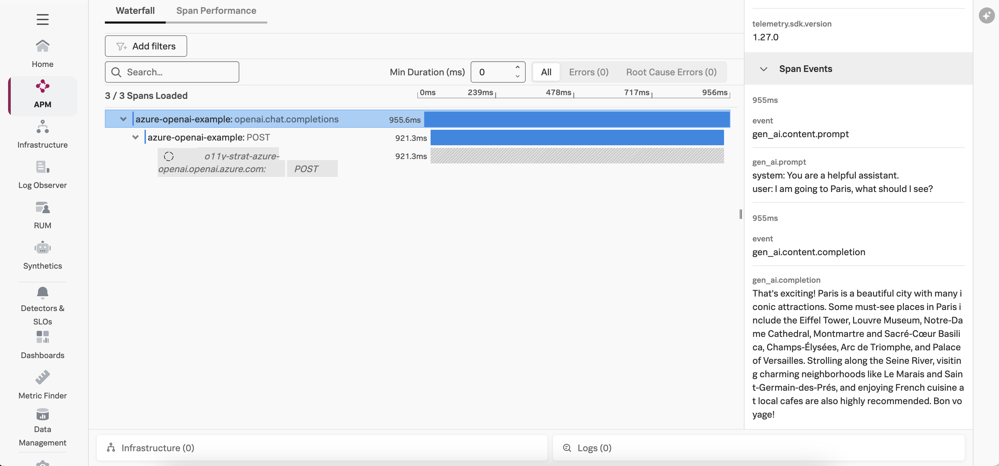

# Azure OpenAI Example with Splunk

This version of the example uses [opentelemetry-instrumentation-openai-v2](https://pypi.org/project/opentelemetry-instrumentation-openai-v2/) 
rather than OpenLIT to instrument the application. 

## Prerequisites

* Azure account with Azure OpenAI enabled (refer to this [document](https://learn.microsoft.com/en-us/azure/ai-services/openai/how-to/create-resource?pivots=web-portal) for details)
* Azure OpenAI deployment with gpt-35-turbo model 
* Splunk distribution of OpenTelemetry collector running on the host where the example is deployed

## Steps to run the example

``` bash
# clone the repo if you haven't already
git clone https://github.com/dmitchsplunk/azure-openai-example.git

# navigate to the directory repo
cd azure-openai-example

# switch to the branch with this specific example
git checkout -b opentelemetry-instrumentation

# create a virtual environment 
python3 -m venv openai-env

# activate the virtual environment
source openai-env/bin/activate

pip install openai==1.68.2

export AZURE_OPENAI_API_KEY="REPLACE_WITH_YOUR_KEY_VALUE_HERE"
export AZURE_OPENAI_ENDPOINT="REPLACE_WITH_YOUR_ENDPOINT_HERE"

python app.py
```

## Add the Splunk Distribution of OpenTelemetry Python

``` bash
export OTEL_SERVICE_NAME=azure-openai-example
export OTEL_RESOURCE_ATTRIBUTES='deployment.environment=test'
export OTEL_EXPORTER_OTLP_ENDPOINT=http://localhost:4317
export OTEL_EXPORTER_OTLP_PROTOCOL=grpc
export OTEL_INSTRUMENTATION_GENAI_CAPTURE_MESSAGE_CONTENT=true

pip install "splunk-opentelemetry[all]"==2.1.0

./openai-env/bin/opentelemetry-bootstrap -a install  

pip install opentelemetry-instrumentation-openai-v2==2.1b0

./openai-env/bin/opentelemetry-instrument python app.py 
```


You should see traces in Splunk Observability Cloud that look like the following: 

